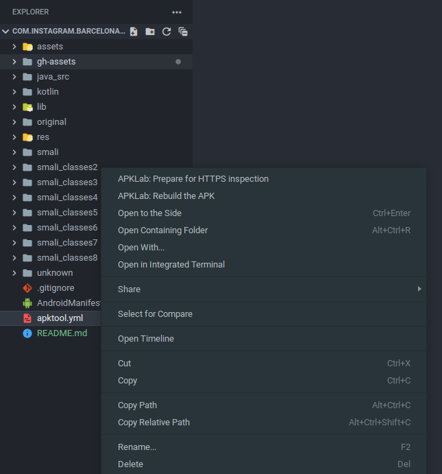

# `com.instagram.barcelona_289.0.0.77.109_x86.apk`

Decompilation of com.instagram.barcelona (Threads) v289.0.0.77.109@x86 (For reference/docs only; only smali will compile)

## "Recompilation" (From Smali Sources)

*(Assuming you're using [APKLab](https://github.com/APKLab/APKLab) on the [official VSCode plugin repo](https://marketplace.visualstudio.com/items?itemName=Surendrajat.apklab), or [OpenVSX](https://open-vsx.org/extension/Surendrajat/apklab) for VSCodium)* ...Anything else ***can*** be used, but we're providing instructions specific to this toolkit for simplicity. If you know what you're doing, go for it!

With APKLab installed and enabled, in VSCode/VSCodium, right-click `apktool.yml`, and click `"APKLab: Rebuild the APK"` near the top. Afterwards, everything should be fairly self-explanatory. (Thanks APKLab!)

<!---->
